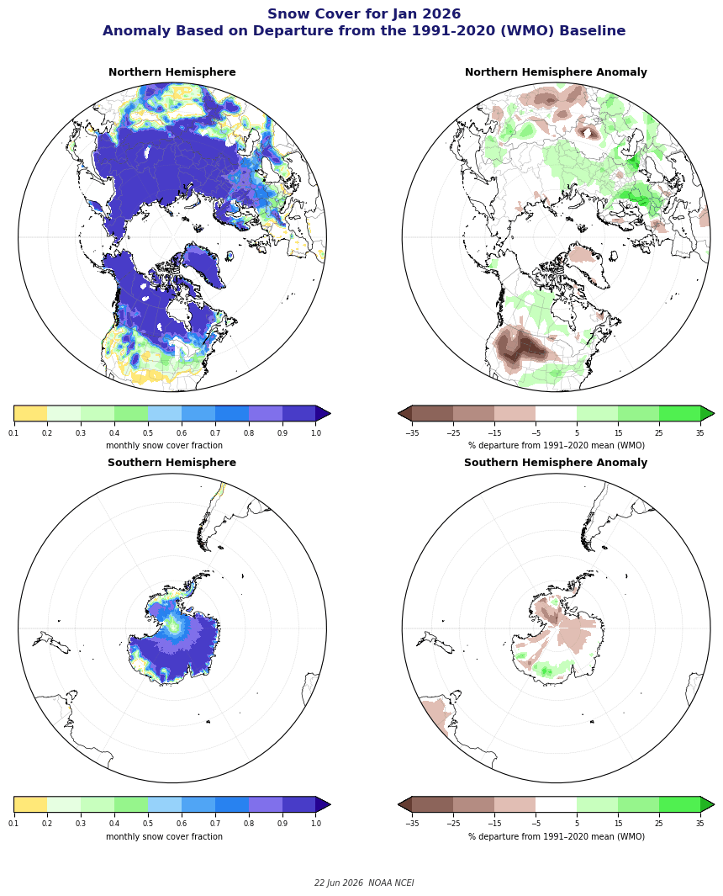
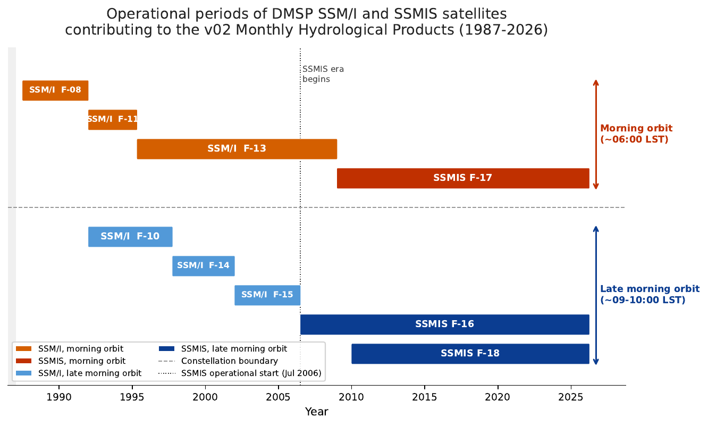
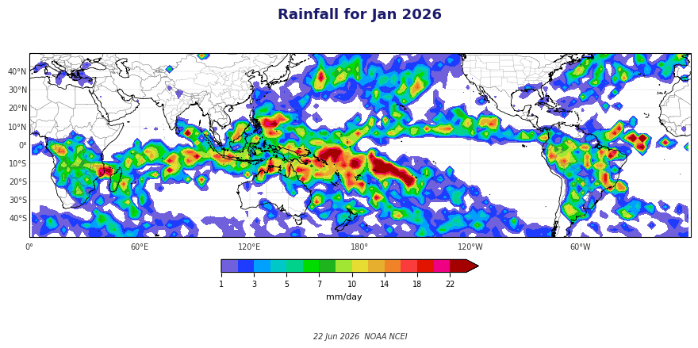

# SSMI(S) Monthly Hydrological Products

[](https://github.com/hilawe/ssmis-hydro-products/actions/workflows/ci.yml)

The SSMI(S) Monthly Hydrological Products are a long-term, globally gridded
passive-microwave record of hydrological variables, including precipitation rate
and frequency, cloud liquid water, water vapor, snow cover, and sea ice, spanning
July 1987 to the present at 2.5 and 1.0 degree resolution. They are derived from
the Defense Meteorological Satellite Program (DMSP) Special Sensor
Microwave/Imager (SSM/I) and Special Sensor Microwave Imager/Sounder (SSMIS)
series and produced operationally at the NOAA National Centers for Environmental
Information (NCEI).

The record is used well beyond its own archive. It provides passive-microwave
input to the [Global Precipitation Climatology Project (GPCP) Climate Data
Record](https://www.ncei.noaa.gov/products/climate-data-records/precipitation-gpcp-daily),
and it contributes every month to the [NOAA Climate Prediction Center (CPC)
Climate Diagnostics
Bulletin](https://www.cpc.ncep.noaa.gov/products/analysis_monitoring/bulletin_0500/index.html).
Sustaining a consistent, well-characterized multi-decadal record across an
evolving satellite constellation, so that downstream products can rely on it
month after month, is the central problem this project addresses.

This repository holds the version 2 processing system. The full chain was
reengineered from a legacy Fortran77, IDL, and GrADS implementation into a single
open-source Python 3 codebase, validated to exact agreement against the original
reference, and hardened with an automated test suite and continuous integration.
Version 2 also corrects two long-standing errors in the prior record and updates
the snow-cover anomaly baseline to the World Meteorological Organization
1991-2020 climate normals.

## Principal Investigator

Hilawe Semunegus (NOAA NCEI) is the Principal Investigator for the SSMI(S)
Monthly Hydrological Products, responsible for the production, scientific
stewardship, validation, and modernization of the record. Ralph R. Ferraro
(University of Maryland ESSIC) is a co-author and the original author of the
retrieval algorithms, which build on the long-established NOAA passive-microwave
hydrology lineage.

## Selected products

Northern and Southern Hemisphere snow cover and anomaly, January 2026:



The DMSP satellite constellation contributing to the record:



Global rainfall, January 2026:



## What is here

- **Climate algorithms** (`monthly/climalg_ssmis.py`): the antenna-to-brightness
  temperature conversion and the precipitation, cloud, water vapor, snow, and sea
  ice retrievals, fully vectorized with NumPy.
- **Monthly assembly** (`monthly/combine.py`, `monthly/pentad_ssmis.py`): multi-year
  record management and 5-day pentad averaging.
- **GPCP merge** (`monthly/gpcp_processing.py`): snow and ice masking and the
  dual-satellite precipitation merge.
- **NetCDF-CF export and validation** (`monthly/netcdf/`): CF-1.5 output and a
  validation harness against the legacy reference.
- **Imagery** (`monthly/grads/run_mon_image.py`): matplotlib and cartopy figures
  that replaced the legacy GrADS scripts.
- **Configuration** (`monthly/satellite_config.py`, `monthly/product_version.py`):
  a single source of truth for the satellite constellation and the product
  version, so a satellite transition is a configuration change.
- **Tests** (`tests/`): a pytest suite covering the radiometric conversion, the
  binary and NetCDF I/O contracts, grid geometry, retrieval invariants, and a
  deterministic bitwise golden-month regression. Continuous integration runs it
  on every push.

## Running the tests

```bash
pip install -r requirements-test.txt   # plus numpy, scipy, netCDF4
python -m pytest tests
```

Tests that require a third-party library or the operational input grids skip
cleanly when those are unavailable, so the suite runs on any host with the
scientific Python stack. The golden-month regression runs only where the
1/3-degree input grids are mounted.

## Scientific and engineering highlights

- A multi-decadal, multi-sensor record sustained across the DMSP morning and
  late-morning constellation chains, intercalibrated into a single continuous
  time series.
- Operational input to the GPCP Climate Data Record and to the monthly CPC
  Climate Diagnostics Bulletin.
- Validated to bitwise-exact agreement on the scattering sampling diagnostic and
  to correlations above 0.998 on every product against the legacy reference, so
  the modern pipeline reproduces the reference rather than approximating it.
- The binary format contract (float32, south-first rows, longitude-fastest) and
  the NetCDF metadata are pinned by the test suite, not just documentation.

## Citation and data

- A companion manuscript is in preparation for the Journal of Atmospheric and
  Oceanic Technology. This README will be updated with the citation on
  acceptance.
- The archived dataset is available from NOAA NCEI.

## License

Public domain under Creative Commons Zero 1.0 (see `LICENSE`).
